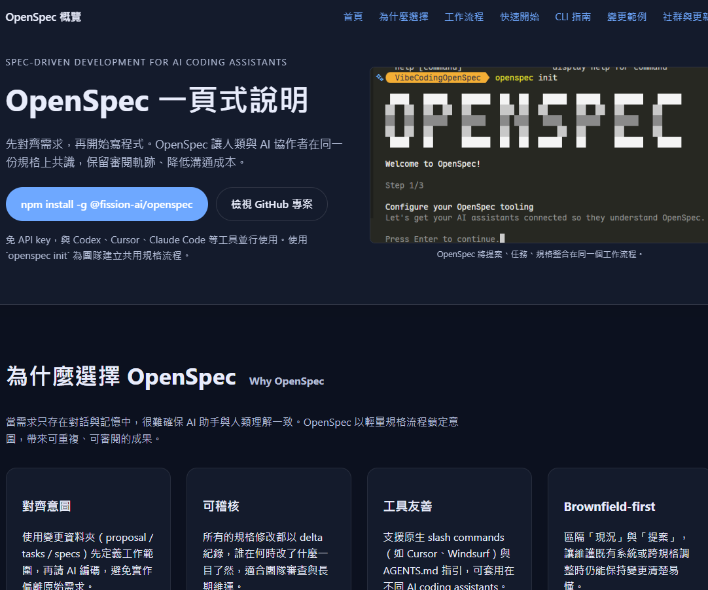

# VibeCodingOpenSpec

Vibe Coding OpenSpec - Spec-driven development for AI coding assistants.


[](https://github.com/Fission-AI/OpenSpec/actions/workflows/ci.yml) [](https://www.npmjs.com/package/@fission-ai/openspec) [](./LICENSE) [](https://discord.gg/YctCnvvshC)

---

# 什麼是 OpenSpec？/ What is OpenSpec?

**OpenSpec** 是一個 **Spec-driven development (SDD)** 框架，專為 AI 編碼助手設計。AI 編碼助手雖然強大，但當需求只存在於聊天記錄中時會變得不可預測。OpenSpec 加入了一個輕量的規範層，讓你在寫任何程式碼之前，先就「要建什麼」達成共識。

> **核心哲學**：
> - fluid not rigid（流暢而非僵化）
> - iterative not waterfall（迭代而非瀑布）
> - easy not complex（簡單而非複雜）fe
> - built for brownfield not just greenfield（支援既有專案不只是新專案）
> - scalable from personal projects to enterprises（從個人專案到企業級都能擴展）

---

# 為什麼選擇 OpenSpec？/ Why OpenSpec?

## 痛點與解決方案

AI 編碼時常面臨以下問題：

| 痛點 | OpenSpec 解決方案 |
|------|------------------|
| 需求只存在對話中，容易遺忘 | 每個變更都有獨立資料夾，包含 proposal、specs、design、tasks |
| 沒有明確的建構順序 | Fluid workflow，可隨時更新任何 artifact |
| 難以追蹤變更歷史 | Archive 功能保留完整的審計軌跡 |
| 與 AI 協作缺乏共識 | 在寫程式碼前，先對規格達成共識 |

## 與其他工具比較

| 工具 | 特性 | OpenSpec 優勢 |
|------|------|---------------|
| **Spec Kit** (GitHub) | 嚴謹但重量級，有繁瑣的階段關卡 | 更輕量，可自由迭代 |
| **Kiro** (AWS) | 強大但受限於特定 IDE 和模型 | 支援 20+ AI 助手 |
| **無規範** | AI 編碼沒有規格 | 帶來可預測性，無繁文縟節 |

---

# 工作流程/ Workflow

## 快速路徑（預設 `core` profile）

```
/opsx:propose ──► /opsx:apply ──► /opsx:archive
```

## 完整工作流程（擴展模式）

```
/opsx:new ──► /opsx:ff 或 /opsx:continue ──► /opsx:apply ──► /opsx:verify ──► /opsx:archive
```

## 實際範例

```
You: /opsx:propose add-dark-mode

AI:  Created openspec/changes/add-dark-mode/
     ✓ proposal.md — 為什麼要做這個變更
     ✓ specs/       — 需求與場景
     ✓ design.md    — 技術方案
     ✓ tasks.md     — 實作檢查清單
     Ready for implementation!

You: /opsx:apply

AI:  Working through tasks...
     ✓ 1.1 建立 ThemeContext
     ✓ 1.2 新增 CSS 變數
     ✓ 1.3 實作 localStorage 持久化
     ✓ 2.1 建立 ThemeToggle 元件
     ...
     All tasks complete!

You: /opsx:archive

AI:  ✓ Merged specs into openspec/specs/ui/spec.md
     ✓ Moved to openspec/changes/archive/2025-01-24-add-dark-mode/
```

---

# 快速開始/ Quick Start

## 前置需求

- **Node.js >= 20.19.0**

確認版本：
```bash
node --version
```

## 安裝

```bash
npm install -g @fission-ai/openspec@latest
```

驗證安裝：
```bash
openspec --version
```

> **注意**：也支援 pnpm、yarn、bun、nix。詳見 [Installation Options](https://github.com/Fission-AI/OpenSpec/blob/main/docs/installation.md)。

## 初始化

```bash
cd your-project
openspec init
```

初始化後的目錄結構：

```
openspec/
├── specs/              # 系統行為的事實來源（Source of Truth）
│   └── <domain>/
│       └── spec.md
├── changes/            # 提議的變更（每個變更一個資料夾）
│   └── <change-name>/
│       ├── proposal.md
│       ├── design.md
│       ├── tasks.md
│       └── specs/      # Delta specs（變更內容）
│           └── <domain>/
│               └── spec.md
└── config.yaml         # 專案配置（可選）
```

---

# 指令參考/ CLI Commands

## Slash 指令（在 AI 助手中使用）

| 指令 | 用途 | 適用情境 |
|------|------|----------|
| `/opsx:propose` | 建立變更 + 規劃 artifacts | 快速預設路徑 |
| `/opsx:explore` | 探索思考 | 需求不明確、調查研究 |
| `/opsx:new` | 開始變更骨架 | 擴展模式、明確控制 artifacts |
| `/opsx:continue` | 建立下一個 artifact | 擴展模式、逐步建立 |
| `/opsx:ff` | 建立所有規劃 artifacts | 範圍明確、想要快速 |
| `/opsx:apply` | 實作 tasks | 準備開始寫程式碼 |
| `/opsx:verify` | 驗證實作是否符合規格 | 擴展模式、歸檔前檢查 |
| `/opsx:sync` | 合併 delta specs | 擴展模式（可選） |
| `/opsx:archive` | 完成變更 | 所有工作完成 |
| `/opsx:bulk-archive` | 批量歸檔多個變更 | 擴展模式、平行工作 |

## CLI 指令（終端機）

```bash
# 列出所有 active 變更
openspec list

# 顯示變更詳情
openspec show <change-name>

# 驗證規格格式
openspec validate <change-name>

# 驗證嚴格模式
openspec validate <change-name> --strict

# 互動式儀表板
openspec view

# 更新 OpenSpec
openspec update

# 切換 profile
openspec config profile
```

---

# Delta Specs 說明

Delta specs 是 OpenSpec 的核心概念，展示相對於目前規格的變更。

## 格式

```markdown
# Delta for Auth

## ADDED Requirements

### Requirement: 雙因素認證
系統必須在登入時要求第二個因素。

#### Scenario: OTP 驗證
- GIVEN 已啟用 2FA 的使用者
- WHEN 使用者提交有效憑證
- THEN 顯示 OTP 挑戰

## MODIFIED Requirements

### Requirement: Session 逾時
系統應在 30 分鐘無活動後使 session 逾時。
（先前：60 分鐘）

## REMOVED Requirements

### Requirement: 記住我
（已廢棄，改用 2FA）
```

## 歸檔時的行為

- **ADDED**：附加到主要 spec
- **MODIFIED**：取代現有版本
- **REMOVED**：從主要 spec 刪除

---

# 社群與更新/ Community & Updates

## 追蹤更新

- 追蹤 [@0xTab on X](https://x.com/0xTab)
- 加入 [OpenSpec Discord](https://discord.gg/YctCnvvshC)

## 更新 OpenSpec

```bash
# 升級套件
npm install -g @fission-ai/openspec@latest

# 重新整理 agent 指令（在每個專案執行）
openspec update
```

## 遙測（Telemetry）

OpenSpec 收集匿名使用統計。僅收集指令名稱和版本，無參數、路徑、內容或個人資訊。

**停用**：`export OPENSPEC_TELEMETRY=0` 或 `export DO_NOT_TRACK=1`

---

# 開發本專案

```bash
# 安裝依賴
pnpm install

# 建置
pnpm run build

# 測試
pnpm test

# 本地開發 CLI
pnpm run dev
```

---

# 圖片預覽



---

# 相關資源

- [Getting Started](https://github.com/Fission-AI/OpenSpec/blob/main/docs/getting-started.md)
- [Workflows](https://github.com/Fission-AI/OpenSpec/blob/main/docs/workflows.md)
- [Commands](https://github.com/Fission-AI/OpenSpec/blob/main/docs/commands.md)
- [CLI Reference](https://github.com/Fission-AI/OpenSpec/blob/main/docs/cli.md)
- [Supported Tools](https://github.com/Fission-AI/OpenSpec/blob/main/docs/supported-tools.md)
- [Concepts](https://github.com/Fission-AI/OpenSpec/blob/main/docs/concepts.md)
- [Customization](https://github.com/Fission-AI/OpenSpec/blob/main/docs/customization.md)

---

# License

MIT
